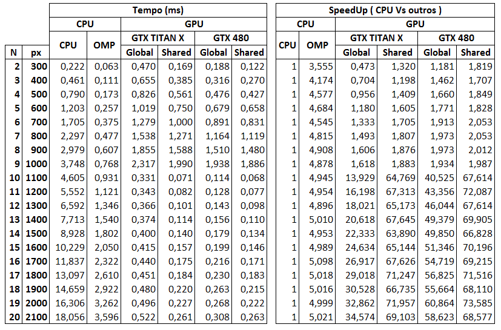
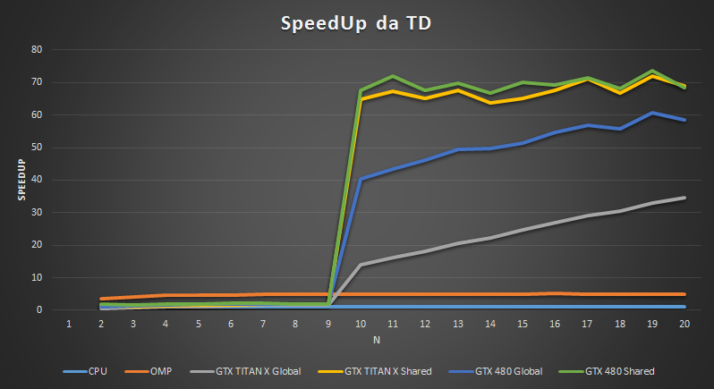

# Segmentação de Imagem com o Algoritmo de Watershed

Disciplina de Processamento de Imagens na GPU

**Implementado por:**

Rafael Cardoso da Silva 21048012


##Versões Implementadas:
- CPU
- CPU com OpenMP
- TD em CUDA em Memória Global
- TD em CUDA em Memória Compratilhada

## Um Exemplo da Segmentação de uma Imagem
**Imagem Original:**
```
0 0 0 0 0 0 0 0 0 0 0 0 0 0 0 0 0 0 0 0
0 0 0 0 0 0 0 0 0 0 0 0 0 0 0 0 0 0 0 0
0 0 0 0 0 1 1 1 0 0 0 0 0 0 0 0 0 0 0 0
0 0 0 1 1 1 1 1 1 1 0 0 0 0 0 0 0 0 0 0
0 0 0 1 1 1 1 1 1 1 0 0 0 0 0 0 0 0 0 0
0 0 1 1 1 1 1 1 1 1 1 0 0 0 0 0 0 0 0 0
0 0 1 1 1 1 1 1 1 1 1 0 0 0 0 0 0 0 0 0
0 0 1 1 1 1 1 1 1 1 1 0 0 0 0 0 0 0 0 0
0 0 0 1 1 1 1 1 1 1 1 1 1 1 1 0 0 0 0 0
0 0 0 1 1 1 1 1 1 1 1 1 1 1 1 1 1 0 0 0
0 0 0 0 0 1 1 1 1 1 1 1 1 1 1 1 1 0 0 0
0 0 0 0 0 0 0 0 1 1 1 1 1 1 1 1 1 1 0 0
0 0 0 0 0 0 0 0 1 1 1 1 1 1 1 1 1 1 0 0
0 0 0 0 0 0 0 0 1 1 1 1 1 1 1 1 1 1 0 0
0 0 0 0 0 0 0 0 1 1 1 1 1 1 1 1 1 1 0 0
0 0 0 0 0 0 0 0 0 1 1 1 1 1 1 1 1 0 0 0
0 0 0 0 0 0 0 0 0 1 1 1 1 1 1 1 1 0 0 0
0 0 0 0 0 0 0 0 0 0 0 1 1 1 1 0 0 0 0 0
0 0 0 0 0 0 0 0 0 0 0 0 0 0 0 0 0 0 0 0
0 0 0 0 0 0 0 0 0 0 0 0 0 0 0 0 0 0 0 0
```

**Transformada de Distância:**
```
0 0 0 0 0 0 0 0 0 0 0 0 0 0 0 0 0 0 0 0
0 0 0 0 0 0 0 0 0 0 0 0 0 0 0 0 0 0 0 0
0 0 0 0 0 1 1 1 0 0 0 0 0 0 0 0 0 0 0 0
0 0 0 1 1 1 2 1 1 1 0 0 0 0 0 0 0 0 0 0
0 0 0 1 2 2 2 2 2 1 0 0 0 0 0 0 0 0 0 0
0 0 1 1 2 3 3 3 2 1 1 0 0 0 0 0 0 0 0 0
0 0 1 2 2 3 4 3 2 2 1 0 0 0 0 0 0 0 0 0
0 0 1 1 2 3 3 3 3 2 1 0 0 0 0 0 0 0 0 0
0 0 0 1 2 2 2 3 3 2 1 1 1 1 1 0 0 0 0 0
0 0 0 1 1 1 2 2 2 2 2 2 2 2 1 1 1 0 0 0
0 0 0 0 0 1 1 1 1 2 3 3 3 2 2 2 1 0 0 0
0 0 0 0 0 0 0 0 1 2 3 4 3 3 3 2 1 1 0 0
0 0 0 0 0 0 0 0 1 2 3 3 4 4 3 2 2 1 0 0
0 0 0 0 0 0 0 0 1 2 2 3 4 4 3 2 2 1 0 0
0 0 0 0 0 0 0 0 1 1 2 3 3 3 3 2 1 1 0 0
0 0 0 0 0 0 0 0 0 1 2 2 2 2 2 2 1 0 0 0
0 0 0 0 0 0 0 0 0 1 1 1 2 2 1 1 1 0 0 0
0 0 0 0 0 0 0 0 0 0 0 1 1 1 1 0 0 0 0 0
0 0 0 0 0 0 0 0 0 0 0 0 0 0 0 0 0 0 0 0
0 0 0 0 0 0 0 0 0 0 0 0 0 0 0 0 0 0 0 0
```

**Corte de Nível (abaixo de 3):**
```
0 0 0 0 0 0 0 0 0 0 0 0 0 0 0 0 0 0 0 0
0 0 0 0 0 0 0 0 0 0 0 0 0 0 0 0 0 0 0 0
0 0 0 0 0 0 0 0 0 0 0 0 0 0 0 0 0 0 0 0
0 0 0 0 0 0 0 0 0 0 0 0 0 0 0 0 0 0 0 0
0 0 0 0 0 0 0 0 0 0 0 0 0 0 0 0 0 0 0 0
0 0 0 0 0 3 3 3 0 0 0 0 0 0 0 0 0 0 0 0
0 0 0 0 0 3 4 3 0 0 0 0 0 0 0 0 0 0 0 0
0 0 0 0 0 3 3 3 3 0 0 0 0 0 0 0 0 0 0 0
0 0 0 0 0 0 0 3 3 0 0 0 0 0 0 0 0 0 0 0
0 0 0 0 0 0 0 0 0 0 0 0 0 0 0 0 0 0 0 0
0 0 0 0 0 0 0 0 0 0 3 3 3 0 0 0 0 0 0 0
0 0 0 0 0 0 0 0 0 0 3 4 3 3 3 0 0 0 0 0
0 0 0 0 0 0 0 0 0 0 3 3 4 4 3 0 0 0 0 0
0 0 0 0 0 0 0 0 0 0 0 3 4 4 3 0 0 0 0 0
0 0 0 0 0 0 0 0 0 0 0 3 3 3 3 0 0 0 0 0
0 0 0 0 0 0 0 0 0 0 0 0 0 0 0 0 0 0 0 0
0 0 0 0 0 0 0 0 0 0 0 0 0 0 0 0 0 0 0 0
0 0 0 0 0 0 0 0 0 0 0 0 0 0 0 0 0 0 0 0
0 0 0 0 0 0 0 0 0 0 0 0 0 0 0 0 0 0 0 0
0 0 0 0 0 0 0 0 0 0 0 0 0 0 0 0 0 0 0 0
```

**Binarizar:**
```
0 0 0 0 0 0 0 0 0 0 0 0 0 0 0 0 0 0 0 0
0 0 0 0 0 0 0 0 0 0 0 0 0 0 0 0 0 0 0 0
0 0 0 0 0 0 0 0 0 0 0 0 0 0 0 0 0 0 0 0
0 0 0 0 0 0 0 0 0 0 0 0 0 0 0 0 0 0 0 0
0 0 0 0 0 0 0 0 0 0 0 0 0 0 0 0 0 0 0 0
0 0 0 0 0 1 1 1 0 0 0 0 0 0 0 0 0 0 0 0
0 0 0 0 0 1 1 1 0 0 0 0 0 0 0 0 0 0 0 0
0 0 0 0 0 1 1 1 1 0 0 0 0 0 0 0 0 0 0 0
0 0 0 0 0 0 0 1 1 0 0 0 0 0 0 0 0 0 0 0
0 0 0 0 0 0 0 0 0 0 0 0 0 0 0 0 0 0 0 0
0 0 0 0 0 0 0 0 0 0 1 1 1 0 0 0 0 0 0 0
0 0 0 0 0 0 0 0 0 0 1 1 1 1 1 0 0 0 0 0
0 0 0 0 0 0 0 0 0 0 1 1 1 1 1 0 0 0 0 0
0 0 0 0 0 0 0 0 0 0 0 1 1 1 1 0 0 0 0 0
0 0 0 0 0 0 0 0 0 0 0 1 1 1 1 0 0 0 0 0
0 0 0 0 0 0 0 0 0 0 0 0 0 0 0 0 0 0 0 0
0 0 0 0 0 0 0 0 0 0 0 0 0 0 0 0 0 0 0 0
0 0 0 0 0 0 0 0 0 0 0 0 0 0 0 0 0 0 0 0
0 0 0 0 0 0 0 0 0 0 0 0 0 0 0 0 0 0 0 0
0 0 0 0 0 0 0 0 0 0 0 0 0 0 0 0 0 0 0 0
```

**Label:**
```
0 0 0 0 0 0 0 0 0 0 0 0 0 0 0 0 0 0 0 0
0 0 0 0 0 0 0 0 0 0 0 0 0 0 0 0 0 0 0 0
0 0 0 0 0 0 0 0 0 0 0 0 0 0 0 0 0 0 0 0
0 0 0 0 0 0 0 0 0 0 0 0 0 0 0 0 0 0 0 0
0 0 0 0 0 0 0 0 0 0 0 0 0 0 0 0 0 0 0 0
0 0 0 0 0 1 1 1 0 0 0 0 0 0 0 0 0 0 0 0
0 0 0 0 0 1 1 1 0 0 0 0 0 0 0 0 0 0 0 0
0 0 0 0 0 1 1 1 1 0 0 0 0 0 0 0 0 0 0 0
0 0 0 0 0 0 0 1 1 0 0 0 0 0 0 0 0 0 0 0
0 0 0 0 0 0 0 0 0 0 0 0 0 0 0 0 0 0 0 0
0 0 0 0 0 0 0 0 0 0 2 2 2 0 0 0 0 0 0 0
0 0 0 0 0 0 0 0 0 0 2 2 2 2 2 0 0 0 0 0
0 0 0 0 0 0 0 0 0 0 2 2 2 2 2 0 0 0 0 0
0 0 0 0 0 0 0 0 0 0 0 2 2 2 2 0 0 0 0 0
0 0 0 0 0 0 0 0 0 0 0 2 2 2 2 0 0 0 0 0
0 0 0 0 0 0 0 0 0 0 0 0 0 0 0 0 0 0 0 0
0 0 0 0 0 0 0 0 0 0 0 0 0 0 0 0 0 0 0 0
0 0 0 0 0 0 0 0 0 0 0 0 0 0 0 0 0 0 0 0
0 0 0 0 0 0 0 0 0 0 0 0 0 0 0 0 0 0 0 0
0 0 0 0 0 0 0 0 0 0 0 0 0 0 0 0 0 0 0 0
```

**Watershed:**
```
0 0 0 0 0 0 0 0 0 0 0 0 0 0 0 0 0 0 0 0
0 0 0 0 0 0 0 0 0 0 0 0 0 0 0 0 0 0 0 0
0 0 0 0 0 - - - 0 0 0 0 0 0 0 0 0 0 0 0
0 0 0 - - - 1 - - - 0 0 0 0 0 0 0 0 0 0
0 0 0 - 1 1 1 1 1 - 0 0 0 0 0 0 0 0 0 0
0 0 - - 1 1 1 1 1 - - 0 0 0 0 0 0 0 0 0
0 0 - 1 1 1 1 1 1 1 - 0 0 0 0 0 0 0 0 0
0 0 - - 1 1 1 1 1 1 - 0 0 0 0 0 0 0 0 0
0 0 0 - 1 1 1 1 1 1 - - - - - 0 0 0 0 0
0 0 0 - - - 1 1 1 - 2 2 2 2 - - - 0 0 0
0 0 0 0 0 - - - - 2 2 2 2 2 2 2 - 0 0 0
0 0 0 0 0 0 0 0 - 2 2 2 2 2 2 2 - - 0 0
0 0 0 0 0 0 0 0 - 2 2 2 2 2 2 2 2 - 0 0
0 0 0 0 0 0 0 0 - 2 2 2 2 2 2 2 2 - 0 0
0 0 0 0 0 0 0 0 - - 2 2 2 2 2 2 - - 0 0
0 0 0 0 0 0 0 0 0 - 2 2 2 2 2 2 - 0 0 0
0 0 0 0 0 0 0 0 0 - - - 2 2 - - - 0 0 0
0 0 0 0 0 0 0 0 0 0 0 - - - - 0 0 0 0 0
0 0 0 0 0 0 0 0 0 0 0 0 0 0 0 0 0 0 0 0
0 0 0 0 0 0 0 0 0 0 0 0 0 0 0 0 0 0 0 0
```

**Destaca-se a borda para finalizar:**
```
0 0 0 0 0 0 0 0 0 0 0 0 0 0 0 0 0 0 0 0
0 0 0 0 0 0 0 0 0 0 0 0 0 0 0 0 0 0 0 0
0 0 0 0 0 1 1 1 0 0 0 0 0 0 0 0 0 0 0 0
0 0 0 1 1 1 0 1 1 1 0 0 0 0 0 0 0 0 0 0
0 0 0 1 0 0 0 0 0 1 0 0 0 0 0 0 0 0 0 0
0 0 1 1 0 0 0 0 0 1 1 0 0 0 0 0 0 0 0 0
0 0 1 0 0 0 0 0 0 0 1 0 0 0 0 0 0 0 0 0
0 0 1 1 0 0 0 0 0 0 1 0 0 0 0 0 0 0 0 0
0 0 0 1 0 0 0 0 0 0 1 1 1 1 1 0 0 0 0 0
0 0 0 1 1 1 0 0 0 1 0 0 0 0 1 1 1 0 0 0
0 0 0 0 0 1 1 1 1 0 0 0 0 0 0 0 1 0 0 0
0 0 0 0 0 0 0 0 1 0 0 0 0 0 0 0 1 1 0 0
0 0 0 0 0 0 0 0 1 0 0 0 0 0 0 0 0 1 0 0
0 0 0 0 0 0 0 0 1 0 0 0 0 0 0 0 0 1 0 0
0 0 0 0 0 0 0 0 1 1 0 0 0 0 0 0 1 1 0 0
0 0 0 0 0 0 0 0 0 1 0 0 0 0 0 0 1 0 0 0
0 0 0 0 0 0 0 0 0 1 1 1 0 0 1 1 1 0 0 0
0 0 0 0 0 0 0 0 0 0 0 1 1 1 1 0 0 0 0 0
0 0 0 0 0 0 0 0 0 0 0 0 0 0 0 0 0 0 0 0
0 0 0 0 0 0 0 0 0 0 0 0 0 0 0 0 0 0 0 0
```

## Tempos Obtidos


## Gráfico de SpeedUp

